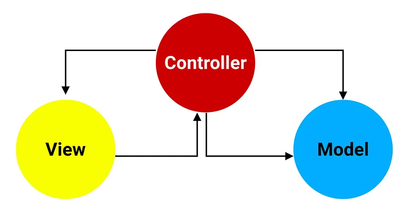

## MVC 



Il pattern MVC è un pattern architetturale che suddivide l'applicazione in 3 componenti:

- Model: rappresenta i dati e la logica dell'applicazione. Incapsula i dati e fornisce i metodi per interagire con essi.

- View: rappresenta l'UI dell'applicazione. Mostra i dati dal modello e intragisce con l'utente per l'input

- Controller: agisce da intermediario tra la View e il Model. Gestisce gli input, modifica il modello in base agli input e aggiorna la grafica. 


### LINEE GUIDA PER APPLICARE MVC A FLUTTER

Consideriamo un'applicazione per gestire una lista di task

MODEL:

Creare una classe per rappresentate dati e logica

```dart: 
class Task {
  String title;
  bool completed;

  Task(this.title, this.completed);
}
```

VIEW

In flutter, i widgets rappresentano i componenti UI

```dart:
class TaskListView extends StatefulWidget {
  final TaskListController controller;

  const TaskListView({
    super.key,
    required this.controller
  });

  @override
  State<TaskListView> createState() => _TaskListViewState();
}

class _TaskListViewState extends State<TaskListView> {
  @override
  Widget build(BuildContext context) {
    return ListView.builder(
      itemCount: widget.controller.tasks.length,
      itemBuilder: (context, index) {
        final task = widget.controller.tasks[index];
        return ListTile(
          title: Text(task.title),
          leading: Checkbox(
            value: task.completed,
            onChanged: (value) {
              setState(() =>
                widget.controller.toggleTaskCompletion(index)
              );
            },
          ),
        );
      },
    );
  }
}

```

CONTROLLER:

Classe che gestisce gli input e aggiorna Model e View

```dart:
class TaskListController {
  List<Task> tasks = [
    Task('Task 1', false),
    Task('Task 2', true),
    Task('Task 3', false),
  ];

  void toggleTaskCompletion(int index) {
    tasks[index].completed = !tasks[index].completed;
  }
}

```

#### Esempio di come si connette tutto:

connettiamo Model, View e Controller in un applicazione:

```dart:
void main() {
  runApp(TaskListApp());
}

class TaskListApp extends StatelessWidget {
  final TaskListController controller = TaskListController();

  TaskListApp({super.key});

  @override
  Widget build(BuildContext context) {
    return MaterialApp(
      home: Scaffold(
        appBar: AppBar(
          title: const Text('Task List'),
        ),
        body: TaskListView(controller: controller),
      ),
    );
  }
}
```
Per il codice completo repo: [Repository taskListManager](https://github.com/Faiz-rhm/TaskList-MVC)

